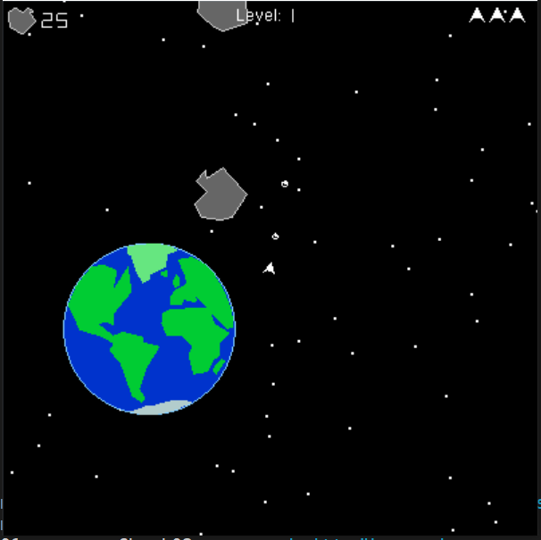

# Asteroids
A simple clone of asteroids with a scrolling level and infinite levels.

This is based on a school project, but the scope has been vastly increased from the project requirements.
The original disign was the basic design for asteroids.
# Additional Features
###  Scrolling Background
* The ship is in the center always and the background moves instead
### Life System
* Whenever hit, the ship respawns until all lives are lost
### Comets
* A faster small ateroid for extra challenge
### Level System
*  After all asteroids are destroyed, a new wave spawns
### Screen Shake
* Screen shakes on certain collisions
### Space Background
* Draws stars and Earth

# Development Environment
* Uses legacy OpenGL
* To build, run `make` in a Linux console in the src directory. This will follow the directions in makefile to assemble the various files and compile them to `asteroids.out`.

# Controls
* Arrow keys to move
* Space Bar to fire

Destroy all of the asteroids to move on to the next level.

# Screenshots

